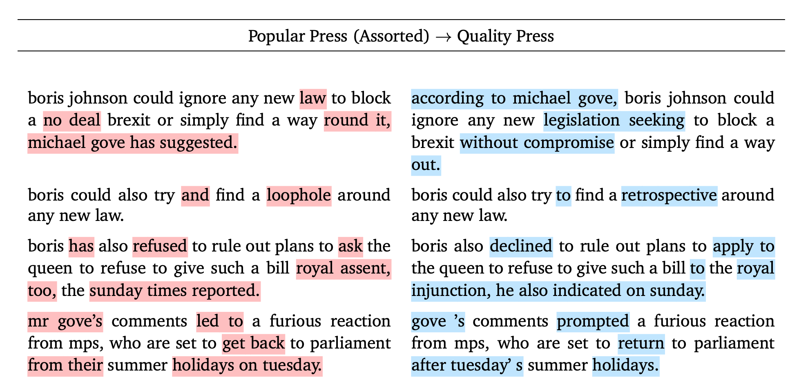

# Scalable Text-Based Style-Transfer

This repository contains the implementation of what used to be my summer thesis. This has evolved over time. 

## Requirements

Using `uv`, I've added a `requirements.txt` that'll allow you to install everything necessary (after installing `python3.9.7+`):

   uv pip install -e .  

This has been tested to run on both Linux and macOS Sequoia and above, and has not been tested on Windows.

## Datasets

To make life easier, I've set up a one-command auto running program that'll deal with downloading all the necessary machine-translation datasets needed to make your model. You'll need `wget` however.

    cd datasets
    ./init_enfr_dataset.sh
    ./political_data.sh

That being said, you'll have to compose your own newspaper dataset, since I'm near certain that releasing such a dataset is not allowed by the newspapers for a variety of reasons, ranging from ethical to legal. In the root directory there is a zip called newspapers. run the jupyter notebook called `downloader_manual.ipynb` to get the article dataset (you'll need to submit your login for The Times in `times.json` first).

If `times.json` isn't created use the following format:

    {
        "action" : "login",
        "username": "TIMES_USERNAME",
        "password": "PASSWORD",
        "s" : 1,
        "rememberMe" : "on"
    }

After running the notebook run `convert_express.sh` and it'll move it to the base directory.

## Running

Once the datasets are downloaded, `cd base/scripts` and run the following:

    cd prod
    ./train_nmt_models.sh
    ./train_pol_st_models.sh
    ./build_pub_corpus.sh
    ./train_pub_st_models.sh
    ./train_pub_naturalness_models.sh

It'll probably take quite a while to train the models.
